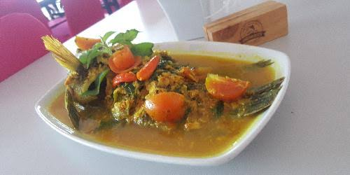

# 🍲 Sentani Bites - Premium Culinary Directory

  

Selamat datang di **Sentani Bites**! Sebuah platform direktori kuliner modern yang dirancang khusus untuk membantu siapa saja menemukan tempat makan terbaik, paling hits, dan menyajikan makanan khas legendaris di wilayah Sentani, Papua.

---

### ✨ Fitur Unggulan
* **Premium UI/UX:** Tampilan kartu makanan interaktif dengan efek 3D melayang (*Floating Card*) dan *Smooth Zoom-In Image*.
* **Real-time Database:** Data kuliner terintegrasi langsung dengan cloud database.
* **Fitur Pencarian Pintar:** Cari makanan atau resto favoritmu dalam hitungan detik.
* **Integrasi Google Maps:** Rute langsung menuju lokasi warung/restoran pilihan.

### 🛠️ Teknologi yang Digunakan
* **Frontend:** HTML5, Tailwind CSS (Modern Styling), JavaScript (ES6+)
* **Backend & Database:** Supabase Real-time Database
* **Hosting:** GitHub Pages

---
👨‍💻 *Developed with ❤️ by [lexsana47-cpu](https://github.com/lexsana47-cpu)*
